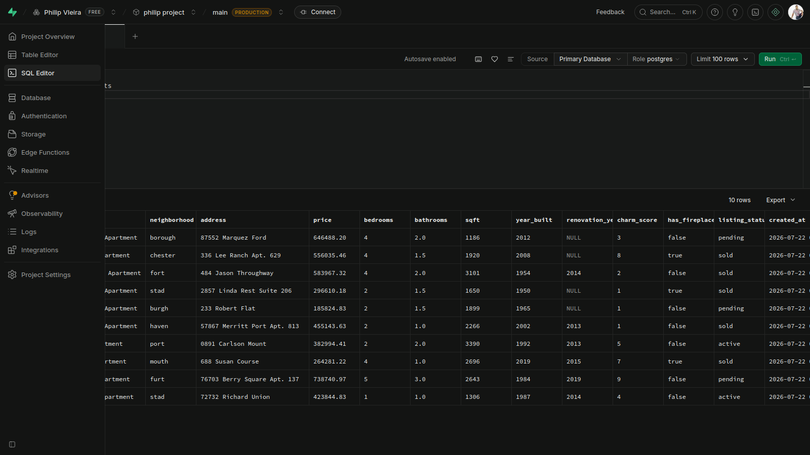

# Cozy Haven Realty - NYC Apartments Database

**A PostgreSQL + Python project** showcasing old and charming apartments in New York.
This project was built with psql shell (postgreSQL in command line).

After created the SQL table I built a Python script to generate mock data. 
The next step was to send this data back to the database on Supabase.


  
(Founder & CEO of Haven Realty).


Build by Philip VIeira


## Project Goals
- Realistic database schema for real estate
- Python script to generate mock data
- Ready for analytics, visualizations, and future web app


## Database Schema
Main table: `apartments`

## How to Run
```bash
pip install psycopg2-binary faker
python setup_apartments.py


Sample Data
Cozy apartments in Brooklyn Heights, West Village, Harlem, etc.

Tech Stack: PostgreSQL (Supabase), Python, Faker


